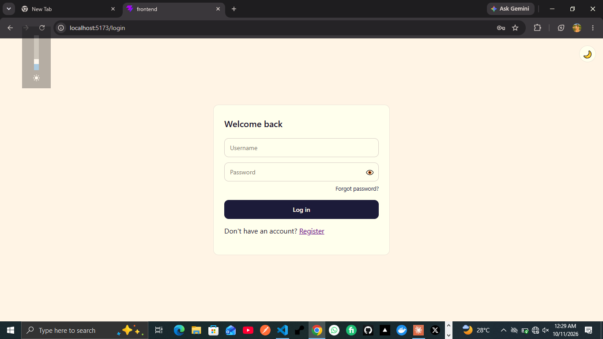
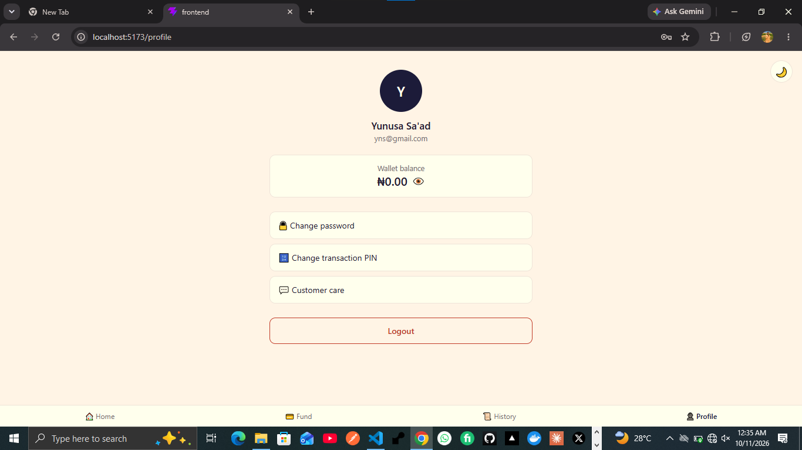
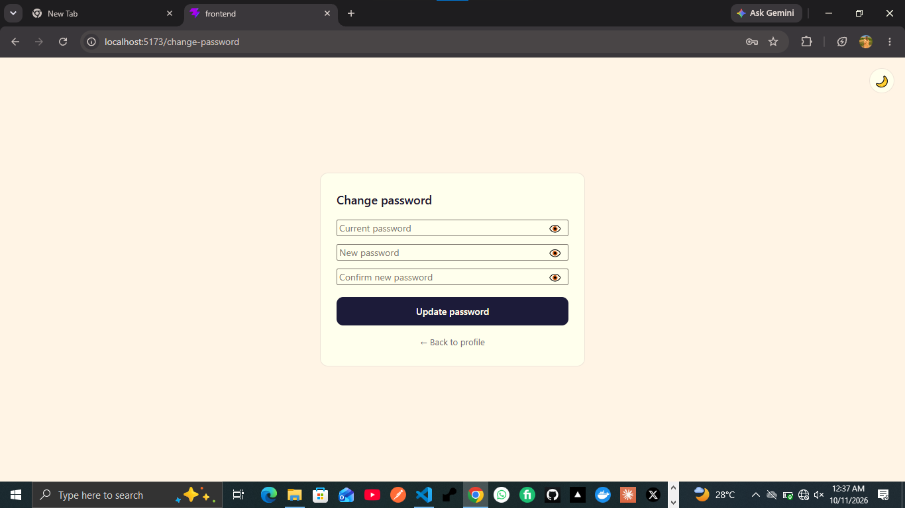

# VTU App — Frontend

React frontend for the VTU app, built with Vite. Talks to the Django REST API in `../backend`.

> 🚧 **Status: Early development.** Account screens (register, login, dashboard, profile, password and PIN management) are complete. Wallet funding and VTU services are planned.

## Tech Stack

- **React** (Vite)
- **react-router-dom** — routing between screens
- **fetch()** — API calls (no axios)
- Plain CSS with shared design tokens (`src/index.css`)

## Project Structure

```
frontend/
├── src/
│   ├── api.jsx                  # fetch wrapper (apiGet / apiPost)
│   ├── components/
│   │   ├── Register.jsx / .css
│   │   ├── Login.jsx / .css
│   │   ├── Dasboard.jsx / .css   # dashboard (balance, services, navigation)
│   │   ├── Profile.jsx / .css
│   │   ├── ChangePassword.jsx / .css
│   │   ├── ChangePIN.jsx / .css
│   │   ├── PasswordInput.jsx     # reusable password field with show/hide toggle
│   │   └── ThemeToggle.jsx / .css # sun/moon light and dark mode switch
│   ├── App.jsx                  # routes
│   ├── main.jsx
│   └── index.css                # global styles and design tokens
├── index.html
└── package.json
```

## Screens

### ✅ Done
- [x] **Register** — full name, username, email, phone number, password, confirm password, 4-digit PIN, confirm PIN. Validates against the backend's rules (phone format, password complexity, PIN confirmation) and displays field-level errors returned by the API. Redirects to login on success.
- [x] **Login** — username and password, JWT-based, with show/hide password toggle and loading state.
- [x] **Logout**
- [x] **Dashboard** — wallet balance with hide/unhide, quick navigation, and service shortcuts.
- [x] **Profile** — account details, wallet balance (follows the dashboard's hide setting), and customer care link.
- [x] **Change Password** — enforces the password rules and rejects reusing the old password.
- [x] **Change Transaction PIN** — 4-digit numeric PIN, rejects reusing the old PIN.
- [x] **Light/dark mode** — sun/moon toggle, remembered between visits.

### 🚧 Planned
- [ ] Forgot Password (needs a verified domain for OTP emails)
- [ ] Fund wallet (virtual account details)
- [ ] Buy Airtime
- [ ] Buy Data
- [ ] Transaction history
- [ ] PWA setup (manifest, service worker, installable)

## Screenshots

### Registration

<p align="center">
    
</p>


### Login

<p align="center">
    
</p>


### Dashboard

<p align="center">
    
</p>

### Profile

<p align="center">
    
</p>

### Change Password

<p align="center">
    
</p>


## Local Setup

```bash
cd frontend
npm install
npm run dev
```

App runs at `http://localhost:5173` by default.

Make sure the backend is running at `http://127.0.0.1:8000` (see `../backend/README.md`) — the API base URL is set in `src/api.jsx`.

## API Connection

All requests go through the helpers in `src/api.jsx` (`apiPost()` and `apiGet()`), which attach the JWT token for protected endpoints:

```js
const BASE_URL = 'http://127.0.0.1:8000/api';
```

Update this when pointing at a deployed backend instead of local.

## Local Storage

The app keeps only light, per-device settings in the browser:

- the JWT token used to stay logged in
- `balance_hidden` — whether the wallet balance is hidden (shared by the dashboard and profile)
- `theme` — light or dark mode

Money and account data always come from the backend, never from local storage.

## Design System

Shared tokens live in `src/index.css` (colors, radius, font) and are reused across every screen's own CSS file, so new screens stay consistent without repeating the same values. Dark mode works by switching a `data-theme` attribute, which swaps the token values.

## Build Approach

Each feature follows this flow before moving to the next:

1. Build the Django API endpoint → test it
2. Build the React UI → test integration
3. Add styling → test again

One feature at a time — no rushing.

## Author

**Huzaifa Sa'ad** ([@Houzsaad](https://github.com/Houzsaad))