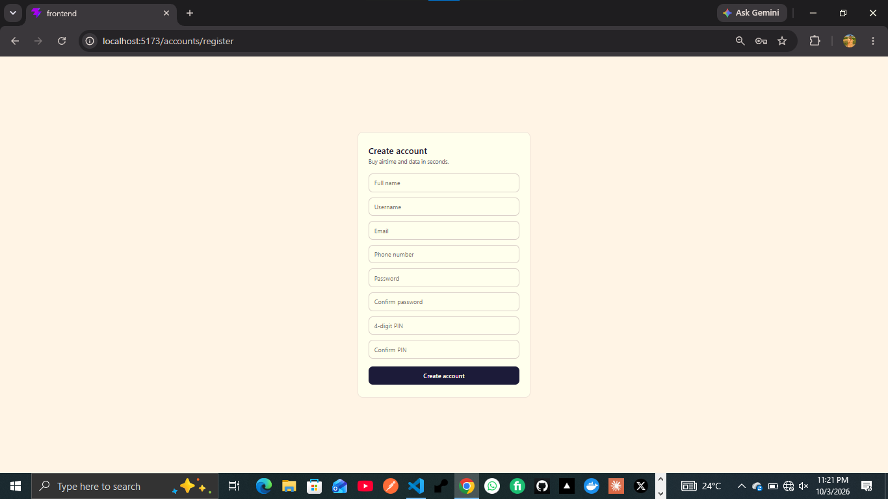

# VTU App — Frontend

React frontend for the VTU app, built with Vite. Talks to the Django REST API in `../backend`.

> 🚧 **Status: Early development.** Registration screen is complete (built, tested, and styled). Other screens are planned.

## Tech Stack

- **React** (Vite)
- **react-router-dom** — routing between screens
- **fetch()** — API calls (no axios)
- Plain CSS with shared design tokens (`src/index.css`)

## Project Structure

```
frontend/
├── src/
│   ├── api.jsx              # fetch wrapper for API calls
│   ├── components/
│   │   └── Register.jsx     # registration screen
│   │   └── Register.css
│   ├── App.jsx
│   ├── main.jsx
│   └── index.css            # global styles & design tokens
├── index.html
└── package.json
```

## Screens

### ✅ Done
- [x] **Register** — full name, username, email, phone number, password, confirm password, 4-digit PIN, confirm PIN. Validates against the backend's rules (phone format, password complexity, PIN confirmation) and displays field-level errors returned by the API.

### 🚧 Planned
- [ ] Login
- [ ] Logout
- [ ] Forgot Password
- [ ] Change Password
- [ ] Profile
- [ ] Dashboard (wallet balance, quick actions)
- [ ] Buy Airtime
- [ ] Buy Data
- [ ] Transaction history
- [ ] PWA setup (manifest, service worker, installable)

## Screenshot

_Registration screen:_


## Registration UI

<p align="center">
    
</p>


## Local Setup

```bash
cd frontend
npm install
npm run dev
```

App runs at `http://localhost:5173` by default.

Make sure the backend is running at `http://127.0.0.1:8000` (see `../backend/README.md`) — the API base URL is set in `src/api.jsx`.

## API Connection

All requests go through `apiPost()` in `src/api.jsx`:

```js
const BASE_URL = 'http://127.0.0.1:8000/api';
```

Update this when pointing at a deployed backend instead of local.

## Design System

Shared tokens live in `src/index.css` (colors, radius, font) and are reused across every screen's own CSS file, so new screens stay consistent without repeating the same values.

## Build Approach

Each feature follows this flow before moving to the next:

1. Build the Django API endpoint → test it
2. Build the React UI → test integration
3. Add styling → test again

One feature at a time — no rushing.


## Author

**Huzaifa Sa'ad** ([@Houzsaad](https://github.com/Houzsaad))
